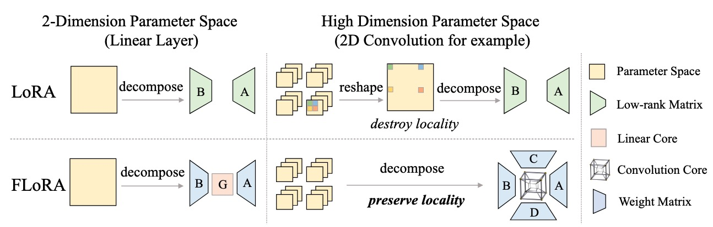

# FLoRA: Low-Rank Core Space for N-dimension

The official implementation of paper: "FLoRA: Low-Rank Core Space for N-dimension".

> **Links: [Arxiv](https://arxiv.org/pdf/2405.14739)**




## Update log
- **2024.07.22: For NLP task (GLUE benchmark), please refer to [Subspace-Tuning](https://github.com/Chongjie-Si/Subspace-Tuning).**
- 2024.07.04: We refactor the core code of FLoRA for simplicity and release the code (**the core implementations are as same as the original implementations**). Please open an issue if you encounter bugs. You can integrate our code into your project easily (see [example](example.py)). Currently, we provide FLoRA layers for `linear`(2 dims), `conv2d`(4 dims), `conv3d`(5 dims), `embeddings`(1 dims). We also provide a base N-dims-FLoRA layer for high dimensions of weights. You can refer to our implementations of class `Linear`, `Conv2D` in `layers.py` for more details and then customize your class.


## TODO
- [x] Refactor the code and release it
- [ ] Release the PEFT-style code
- [ ] Release the task-specific code in our paper.

## Reference
``` bibtex
@article{si2024flora,
  title={FLoRA: Low-Rank Core Space for N-dimension},
  author={Si, Chongjie* and Wang, Xuehui* and Yang, Xue and Xu, Zhengqin and Li, Qingyun and Dai, Jifeng and Qiao, Yu and Yang, Xiaokang and Shen, Wei},
  journal={arXiv preprint arXiv:2405.14739},
  year={2024}
}
```
